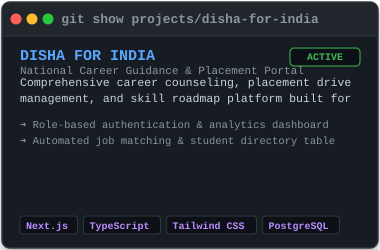
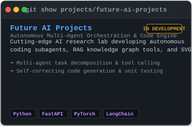
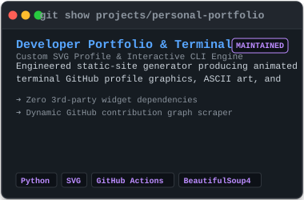

<!-- Terminal Header Banner -->

  

<!-- SECTION 1: CONTRIBUTIONS -->
<h3><code>sgo453071-arch@github:~$ git log --contributions</code></h3>

  

<!-- SECTION 2: WHOAMI (ASCII PORTRAIT + NEOFETCH INFO CARD) -->
<h3><code>sgo453071-arch@github:~$ whoami</code></h3>

<table border="0" cellspacing="0" cellpadding="0" style="border: none; border-collapse: collapse;">
  <tr style="border: none;">
    <td align="center" valign="top" style="border: none; padding: 4px;">
      
    </td>
    <td align="center" valign="top" style="border: none; padding: 4px;">
      
    </td>
  </tr>
</table>

  

<!-- SECTION 3: PROJECTS SHOWCASE -->
<h3><code>sgo453071-arch@github:~$ ls -l ./projects/</code></h3>

<table border="0" cellspacing="0" cellpadding="0" style="border: none; border-collapse: collapse;">
  <tr style="border: none;">
    <td align="center" valign="top" style="border: none; padding: 4px;">
      
    </td>
    <td align="center" valign="top" style="border: none; padding: 4px;">
      
    </td>
  </tr>
  <tr style="border: none;">
    <td align="center" colspan="2" valign="top" style="border: none; padding: 4px;">
      
    </td>
  </tr>
</table>

  

<!-- SECTION 4: SKILLS MATRIX -->
<h3><code>sgo453071-arch@github:~$ cat ./config/skills.json</code></h3>

  

<!-- SECTION 5: SOCIAL CONNECT & FOOTER -->
<h3><code>sgo453071-arch@github:~$ cat ./socials.txt</code></h3>

  
  &nbsp;
  
  &nbsp;
  
  &nbsp;
  
  &nbsp;
  
  &nbsp;
  

 

  ⚡ Handcrafted locally with Python, OpenCV &amp; SVG. Zero third-party profile widgets. Automated via GitHub Actions.

